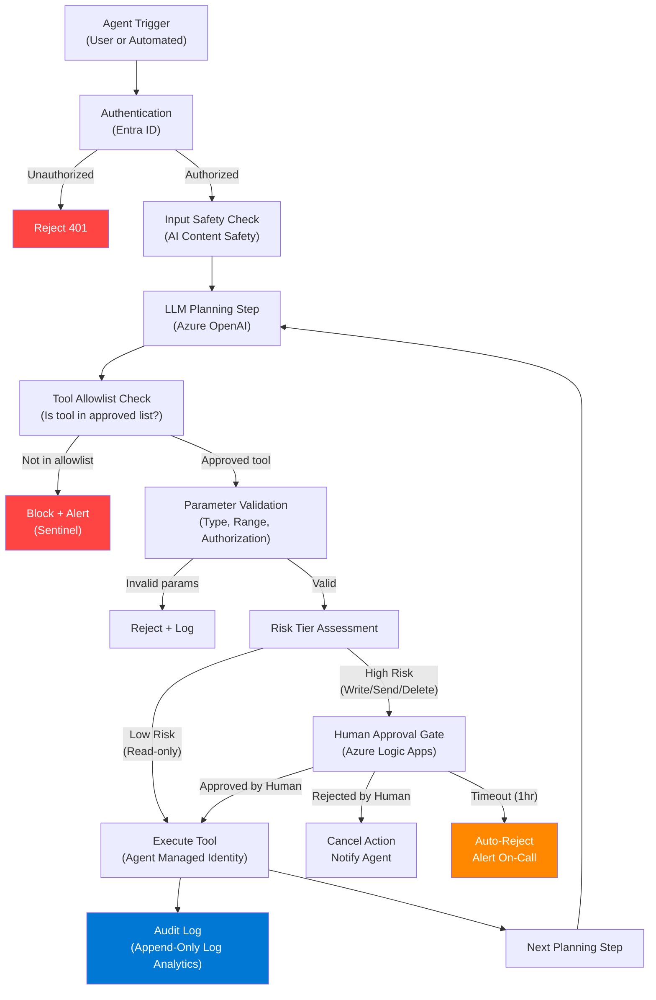
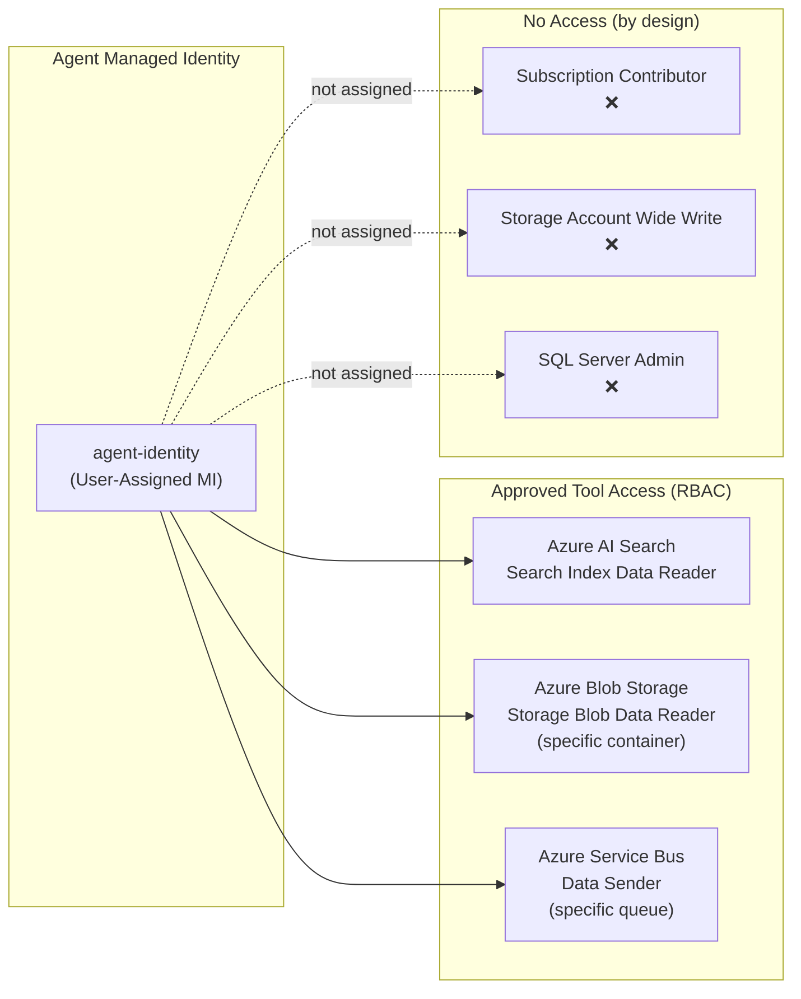
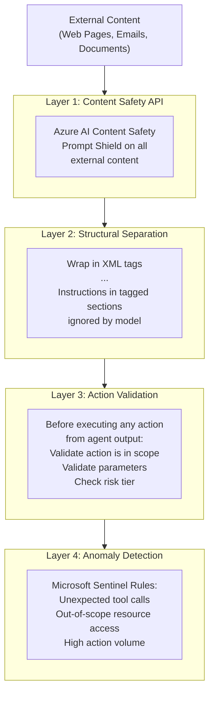

# AI Agent Security Flow Diagrams

## Agent Execution Security Flow

```mermaid
flowchart TD
    Trigger["Agent Trigger\n(User or Automated)"] --> Auth["Authentication\n(Entra ID)"]
    Auth -- "Unauthorized" --> Reject["Reject 401"]
    Auth -- "Authorized" --> InputSafety["Input Safety Check\n(AI Content Safety)"]
    InputSafety --> LLMPlan["LLM Planning Step\n(Azure OpenAI)"]
    LLMPlan --> AllowlistCheck["Tool Allowlist Check\n(Is tool in approved list?)"]
    AllowlistCheck -- "Not in allowlist" --> BlockTool["Block + Alert\n(Sentinel)"]
    AllowlistCheck -- "Approved tool" --> ParamValidation["Parameter Validation\n(Type, Range, Authorization)"]
    ParamValidation -- "Invalid params" --> RejectParams["Reject + Log"]
    ParamValidation -- "Valid" --> RiskAssessment["Risk Tier Assessment"]

    RiskAssessment -- "Low Risk\n(Read-only)" --> Execute["Execute Tool\n(Agent Managed Identity)"]
    RiskAssessment -- "High Risk\n(Write/Send/Delete)" --> ApprovalGate["Human Approval Gate\n(Azure Logic Apps)"]

    ApprovalGate -- "Approved by Human" --> Execute
    ApprovalGate -- "Rejected by Human" --> Cancel["Cancel Action\nNotify Agent"]
    ApprovalGate -- "Timeout (1hr)" --> AutoReject["Auto-Reject\nAlert On-Call"]

    Execute --> AuditLog["Audit Log\n(Append-Only Log Analytics)"]
    Execute --> NextStep["Next Planning Step"]
    NextStep --> LLMPlan

    style Reject fill:#ff4444,color:#fff
    style BlockTool fill:#ff4444,color:#fff
    style AutoReject fill:#ff8800,color:#fff
    style AuditLog fill:#0078d4,color:#fff
```

## Agent Tool Authorization Model

```mermaid
flowchart LR
    subgraph AgentIdentity["Agent Managed Identity"]
        AgentMI["agent-identity\n(User-Assigned MI)"]
    end

    subgraph ApprovedTools["Approved Tool Access (RBAC)"]
        SearchReader["Azure AI Search\nSearch Index Data Reader"]
        StorageReader["Azure Blob Storage\nStorage Blob Data Reader\n(specific container)"]
        ServiceBusSend["Azure Service Bus\nData Sender\n(specific queue)"]
    end

    subgraph BlockedAccess["No Access (by design)"]
        SubContrib["Subscription Contributor\n❌"]
        StorageWriter["Storage Account Wide Write\n❌"]
        SQLDB["SQL Server Admin\n❌"]
    end

    AgentMI --> SearchReader
    AgentMI --> StorageReader
    AgentMI --> ServiceBusSend
    AgentMI -. "not assigned" .-> SubContrib
    AgentMI -. "not assigned" .-> StorageWriter
    AgentMI -. "not assigned" .-> SQLDB
```

## Prompt Injection Defense Layers

```mermaid
flowchart TD
    ExternalContent["External Content\n(Web Pages, Emails, Documents)"] --> Layer1

    subgraph Layer1["Layer 1: Content Safety API"]
        ContentSafetyCheck["Azure AI Content Safety\nPrompt Shield on all\nexternal content"]
    end

    Layer1 --> Layer2

    subgraph Layer2["Layer 2: Structural Separation"]
        Delimiters["Wrap in XML tags\n<tool_output>...</tool_output>\nInstructions in tagged sections\nignored by model"]
    end

    Layer2 --> Layer3

    subgraph Layer3["Layer 3: Action Validation"]
        ActionValidation["Before executing any action\nfrom agent output:\nValidate action is in scope\nValidate parameters\nCheck risk tier"]
    end

    Layer3 --> Layer4

    subgraph Layer4["Layer 4: Anomaly Detection"]
        Sentinel["Microsoft Sentinel Rules:\nUnexpected tool calls\nOut-of-scope resource access\nHigh action volume"]
    end
```
