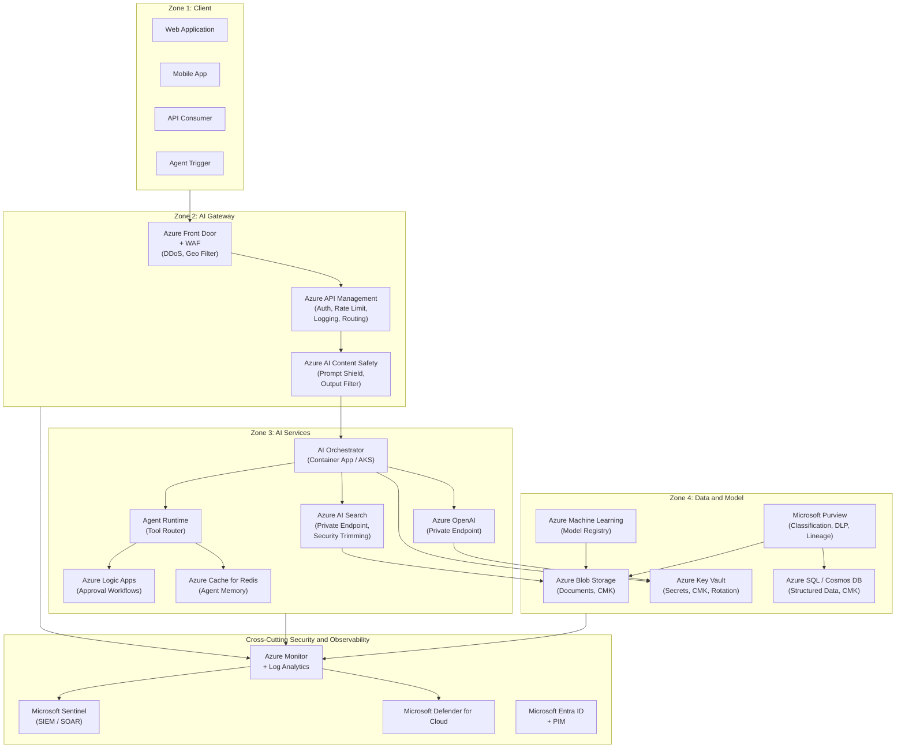
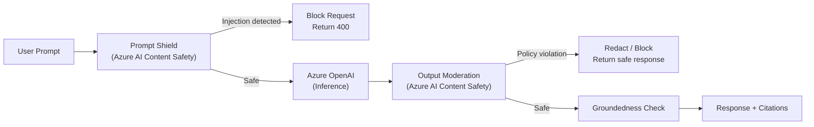

# Enterprise AI Security Reference Architecture

Full Mermaid diagram of the enterprise AI security reference architecture.

## High-Level Zone Architecture



## Authentication Flow

```mermaid
sequenceDiagram
    participant User
    participant EntraID as Microsoft Entra ID
    participant APIM as Azure API Management
    participant Orchestrator as AI Orchestrator
    participant OpenAI as Azure OpenAI

    User->>EntraID: Authenticate (username + MFA)
    EntraID-->>User: JWT Access Token
    User->>APIM: Request + JWT Token
    APIM->>EntraID: Validate JWT
    EntraID-->>APIM: Token valid; claims returned
    APIM->>Orchestrator: Forwarded request (user identity in header)
    Note over Orchestrator: Uses managed identity (no API key)
    Orchestrator->>OpenAI: Request + Managed Identity Token
    OpenAI-->>Orchestrator: Completion response
    Orchestrator-->>User: Response + citations
```

## Content Safety Flow


