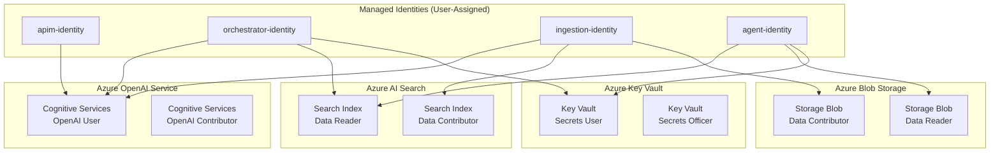
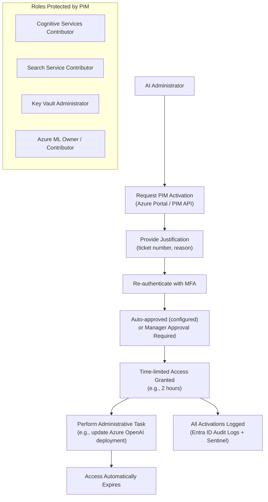
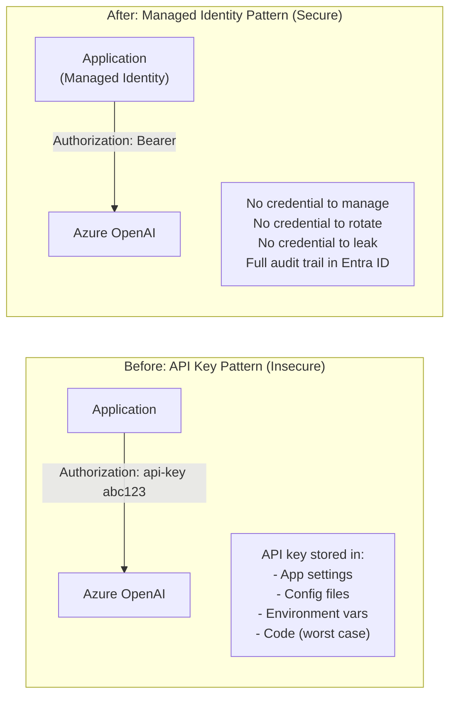

# Identity and Access Patterns for AI Systems

## Managed Identity Assignment Pattern



## User Authentication Flow (Entra ID OAuth 2.0)

```mermaid
sequenceDiagram
    participant User as User / Browser
    participant App as AI Application
    participant EntraID as Microsoft Entra ID
    participant APIM as Azure API Management
    participant Orchestrator as AI Orchestrator

    User->>App: Access AI feature
    App->>EntraID: Redirect to login (MSAL)
    EntraID->>User: MFA challenge
    User->>EntraID: Credentials + MFA
    EntraID-->>App: Authorization code
    App->>EntraID: Exchange code for tokens
    EntraID-->>App: Access token + refresh token
    App->>APIM: API request + Bearer token
    APIM->>EntraID: Validate token (JWKS endpoint)
    EntraID-->>APIM: Token valid; claims
    APIM->>Orchestrator: Forward request + user claims
    Note over Orchestrator: Logs user identity with every LLM call
```

## Privileged Access Management (PIM) Flow



## API Key Elimination Strategy


