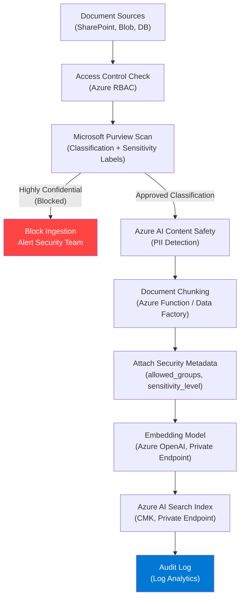
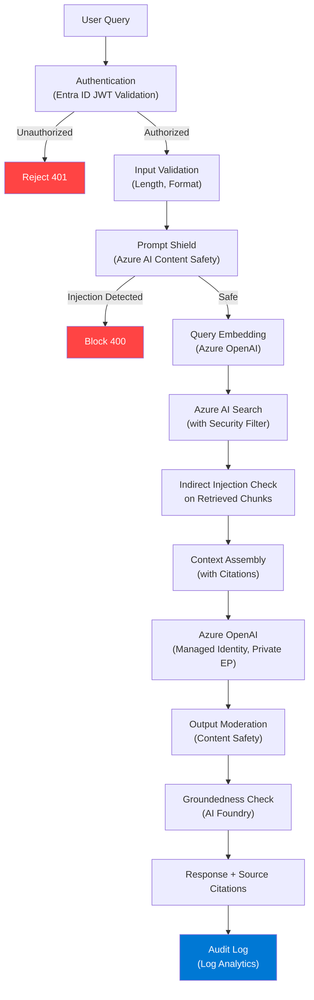
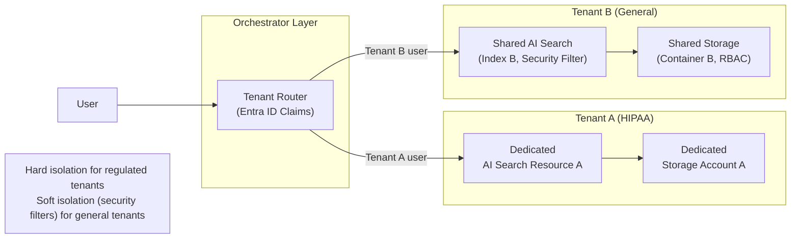

# Secure RAG Pipeline Data Flow Diagrams

## Ingestion Pipeline Security Flow

```mermaid
flowchart TD
    DocSources["Document Sources\n(SharePoint, Blob, DB)"] --> AccessControl["Access Control Check\n(Azure RBAC)"]
    AccessControl --> PurviewScan["Microsoft Purview Scan\n(Classification + Sensitivity Labels)"]
    PurviewScan -- "Highly Confidential\n(Blocked)" --> BlockIngestion["Block Ingestion\nAlert Security Team"]
    PurviewScan -- "Approved Classification" --> ContentSafety["Azure AI Content Safety\n(PII Detection)"]
    ContentSafety --> Chunking["Document Chunking\n(Azure Function / Data Factory)"]
    Chunking --> SecurityMetadata["Attach Security Metadata\n(allowed_groups, sensitivity_level)"]
    SecurityMetadata --> EmbeddingModel["Embedding Model\n(Azure OpenAI, Private Endpoint)"]
    EmbeddingModel --> VectorIndex["Azure AI Search Index\n(CMK, Private Endpoint)"]
    VectorIndex --> AuditLog["Audit Log\n(Log Analytics)"]

    style BlockIngestion fill:#ff4444,color:#fff
    style AuditLog fill:#0078d4,color:#fff
```

## Query Pipeline Security Flow

```mermaid
flowchart TD
    UserQuery["User Query"] --> AuthCheck["Authentication\n(Entra ID JWT Validation)"]
    AuthCheck -- "Unauthorized" --> Reject["Reject 401"]
    AuthCheck -- "Authorized" --> InputValidation["Input Validation\n(Length, Format)"]
    InputValidation --> PromptShield["Prompt Shield\n(Azure AI Content Safety)"]
    PromptShield -- "Injection Detected" --> Block["Block 400"]
    PromptShield -- "Safe" --> Embedding["Query Embedding\n(Azure OpenAI)"]
    Embedding --> VectorSearch["Azure AI Search\n(with Security Filter)"]
    VectorSearch --> InjectionCheck["Indirect Injection Check\non Retrieved Chunks"]
    InjectionCheck --> ContextAssembly["Context Assembly\n(with Citations)"]
    ContextAssembly --> LLMCall["Azure OpenAI\n(Managed Identity, Private EP)"]
    LLMCall --> OutputModeration["Output Moderation\n(Content Safety)"]
    OutputModeration --> GroundednessCheck["Groundedness Check\n(AI Foundry)"]
    GroundednessCheck --> Response["Response + Source Citations"]
    Response --> AuditLog["Audit Log\n(Log Analytics)"]

    style Reject fill:#ff4444,color:#fff
    style Block fill:#ff4444,color:#fff
    style AuditLog fill:#0078d4,color:#fff
```

## Multi-Tenant RAG Isolation

```mermaid
flowchart LR
    subgraph TenantA["Tenant A (HIPAA)"]
        SearchA["Dedicated\nAI Search Resource A"]
        StorageA["Dedicated\nStorage Account A"]
    end

    subgraph TenantB["Tenant B (General)"]
        SearchB["Shared AI Search\n(Index B, Security Filter)"]
        StorageB["Shared Storage\n(Container B, RBAC)"]
    end

    subgraph Orchestrator["Orchestrator Layer"]
        Router["Tenant Router\n(Entra ID Claims)"]
    end

    User --> Router
    Router -- "Tenant A user" --> SearchA
    Router -- "Tenant B user" --> SearchB
    SearchA --> StorageA
    SearchB --> StorageB

    note["Hard isolation for regulated tenants\nSoft isolation (security filters) for general tenants"]
```
